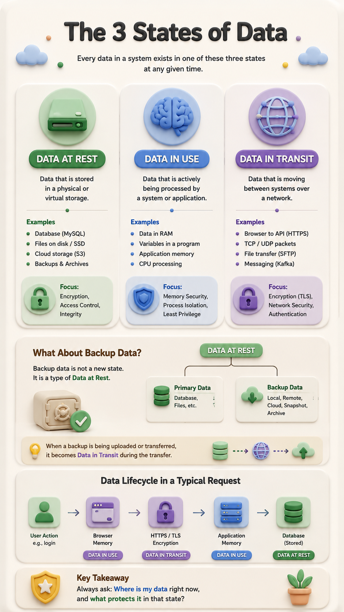

# Foundation — The Three States of Data

!!! question "The question"
    Your data sits in a database, moves across the network, and lives in RAM while code
    runs on it. You've learned all three mechanisms separately — is there a single model
    that ties them together?

**"data at rest, data in use, and data in transit" isn't really a programming concept**. It's primarily a **systems/security concept**—and your learning path has mostly been organized around technologies and mechanisms rather than the lifecycle of data.

The three states are:

| State                  | Meaning                        | Example                                                       |
| ---------------------- | ------------------------------ | ------------------------------------------------------------- |
| 🗄️ **Data at Rest**   | Data being stored              | MySQL database, hard drive, S3 object                         |
| 🧠 **Data in Use**     | Data currently being processed | Data loaded into RAM while your PHP/Go/JS program works on it |
| 🌐 **Data in Transit** | Data moving between systems    | Browser → API over HTTPS                                      |



## Why you probably missed it

You've learned pieces of all three, but **under different names**.

For example:

**Data at rest**
→ MySQL → filesystems → databases → backups → storage

**Data in use**
→ RAM → variables → processes → CPU → application memory

**Data in transit**
→ TCP/IP → ports → HTTP → HTTPS → TLS → DNS → routing

So you've actually been learning the *mechanisms*, but nobody necessarily gave you the **higher-level classification**.

And this is exactly the kind of thing that can make your networking/system learning feel fragmented:

> **You learned the machinery before learning the model that connects the machinery.**

## There's an even more important distinction

Don't memorize these as simply:

> stored / running / transit

The standard terminology is:

**Data at Rest → Data in Use → Data in Transit (or Data in Motion)**

And these states correspond to different security concerns:

```text
                 DATA
                  │
       ┌──────────┼──────────┐
       ↓          ↓          ↓
   AT REST      IN USE    IN TRANSIT
       │          │          │
    Storage      RAM       Network
       │          │          │
   Encryption   Memory    TLS/HTTPS
   access       process   network
   control      isolation security
```

For someone moving toward **backend/system engineering**, this is an important mental model because it lets you ask:

> **Where is my data right now, and what protects it in that state?**

For example, when a user logs into your application:

```text
User types password
       ↓
Browser memory
       │
       │  DATA IN USE
       ↓
HTTPS/TLS
       │
       │  DATA IN TRANSIT
       ↓
Web server
       ↓
Application memory
       │
       │  DATA IN USE
       ↓
Database
       │
       │  DATA AT REST
       ↓
Disk / backup
```

That's a much more powerful way of understanding security than memorizing three definitions.

And honestly, **this is a gap worth fixing in your learning approach**: start looking for the *models that connect technologies*, not only the technologies themselves.
